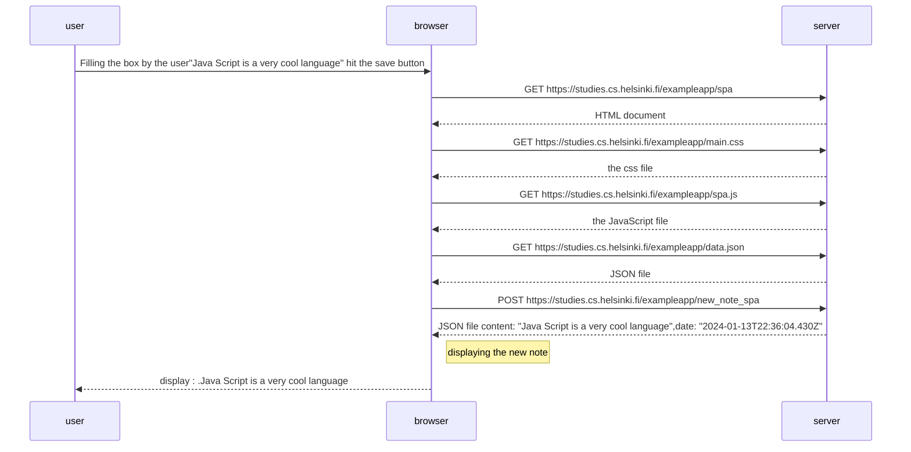

# Sequence Diagram New Notes 

```mermaid
sequenceDiagram
    participant user
    participant browser
    participant server

    user->>browser : Filling the box by the user"Java Script is a very cool language" hit the save button
    browser->>server: GET https://studies.cs.helsinki.fi/exampleapp/spa
    server-->>browser: HTML document

    browser->>server: GET https://studies.cs.helsinki.fi/exampleapp/main.css
    server-->>browser: the css file

    browser->>server: GET https://studies.cs.helsinki.fi/exampleapp/spa.js
    server-->>browser: the JavaScript file

    browser->>server: GET https://studies.cs.helsinki.fi/exampleapp/data.json
    server-->>browser: JSON file

    browser->>server: POST https://studies.cs.helsinki.fi/exampleapp/new_note_spa
    server-->>browser: JSON file content: "Java Script is a very cool language",date: "2024-01-13T22:36:04.430Z"
    Note right of browser : displaying the new note
    browser-->>user: display : .Java Script is a very cool language
    
```