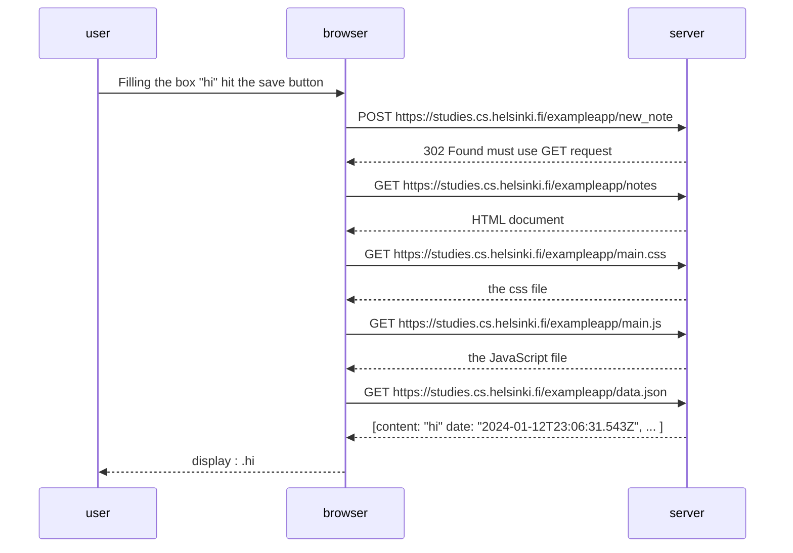

# Sequence Diagram New Notes 

```mermaid
sequenceDiagram
    participant user
    participant browser
    participant server

    user->>browser : Filling the box "hi" hit the save button
    browser->>server: POST https://studies.cs.helsinki.fi/exampleapp/new_note
    server-->>browser: 302 Found must use GET request

    browser->>server: GET https://studies.cs.helsinki.fi/exampleapp/notes
    server-->>browser: HTML document

    browser->>server: GET https://studies.cs.helsinki.fi/exampleapp/main.css
    server-->>browser: the css file

    browser->>server: GET https://studies.cs.helsinki.fi/exampleapp/main.js
    server-->>browser: the JavaScript file

    browser->>server: GET https://studies.cs.helsinki.fi/exampleapp/data.json
    server-->>browser: [content: "hi" date: "2024-01-12T23:06:31.543Z", ... ]
    browser-->>user: display : .hi
```