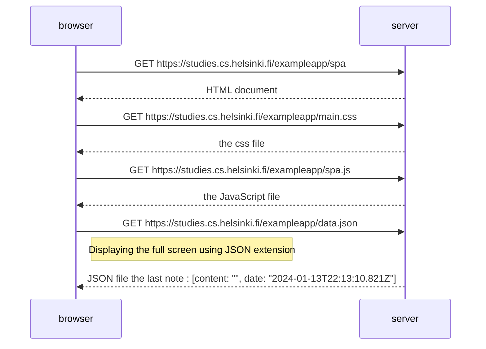

# Sequence Diagram Single Page App

```mermaid
sequenceDiagram
    participant browser
    participant server


    browser->>server: GET https://studies.cs.helsinki.fi/exampleapp/spa
    server-->>browser: HTML document

    browser->>server: GET https://studies.cs.helsinki.fi/exampleapp/main.css
    server-->>browser: the css file

    browser->>server: GET https://studies.cs.helsinki.fi/exampleapp/spa.js
    server-->>browser: the JavaScript file

    browser->>server: GET https://studies.cs.helsinki.fi/exampleapp/data.json
    Note right of browser : Displaying the full screen using JSON extension
    server-->>browser: JSON file the last note : [content: "", date: "2024-01-13T22:13:10.821Z"] 


```